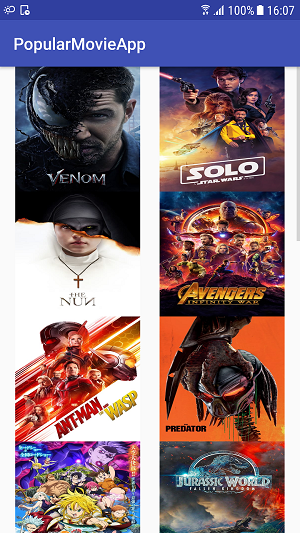

# Popular Movies Project 

## Project Overview

In this project,  **Popular Movies** app to
shows the details of each movie once it is selected.

## What is demonstrated?
Through this project, I will:

- Practice JSON parsing to a model object
- Design an activity layout
- Populate all fields in the layout accordingly
- Design the layout for the detail activity so the different elements
display in a sensible way. Implement the JSON parsing in JsonUtils so it
produces a Movie Object that can be used to populate the UI that I designed.
- retrieve the JSON format data from The MovieDb api and display the most popular movies

This product uses the TMDb API but is not endorsed or certified by TMDb

